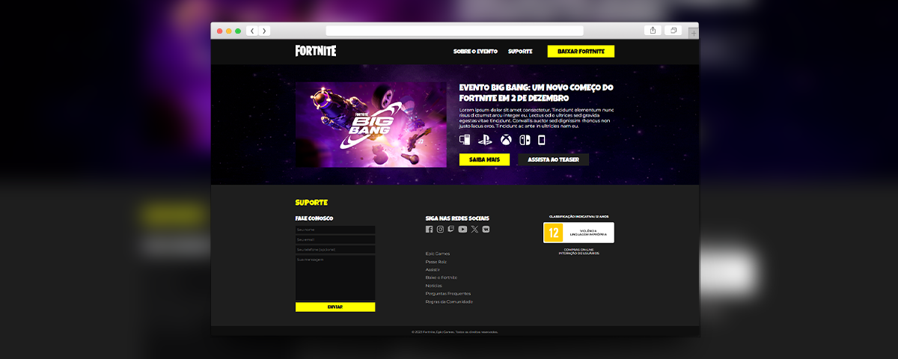

  

<h1 align="center">Projeto Site Fortnite - Evento Big Bang</h1>

<h2>👩🏻‍💻 Projeto</h2>

   Projeto realizado como exercício do módulo 5 do curso Desenvolvimento Front-end do Zero ao Pro da EBAC - Escola Britânica de Artes Criativas e Tecnologia.

 

<h2>🎯 Objetivo</h2>

  Este projeto consiste na construção de um site com tema a escolha usando como base o projeto que foi criado durante o módulo, utilizando elementos de imagens, formulários, títulos e fontes customizadas. Eu escolhi criar um site fictício sobre o Evento Big Bang do jogo Fortnite. 🎮

 

<h2>💻 Linguagens & Ferramentas</h2>

* HTML5
* CSS3
* Git
* VSCode
* Figma
 

